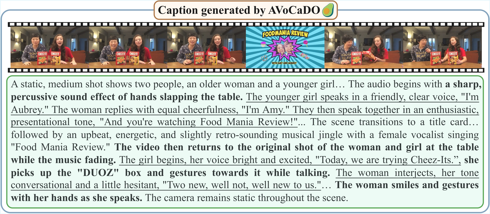

#  AVoCaDO: An <u>A</u>udio<u>V</u>isual Vide<u>o</u> <u>Ca</u>ptioner <u>D</u>riven by Temporal <u>O</u>rchestration

<p align="left">
  <a href="https://avocado-captioner.github.io/"></a>
  <a href="https://huggingface.co/AVoCaDO-Captioner/AVoCaDO"></a>
  <a href="https://arxiv.org/abs/todo"></a>
</p>

---

## ✨ Overview
Audiovisual video captioning aims to generate semantically rich descriptions with temporal alignment between visual and auditory events, thereby benefiting both video understanding and generation. We introduce <b>AVoCaDO</b>, a powerful audiovisual video captioner driven by the temporal orchestration between audio and visual modalities. Experimental results demonstrate that AVoCaDO significantly outperforms existing open-source models across four audiovisual video captioning benchmarks, and also achieves competitive performance under visual-only settings.

## 🎬 Captioning Case of AVoCaDO

An illustration of a video caption generated by AVoCaDO, featuring both <b>precise audiovisual temporal alignment</b> and <u>accurate dialogue rendering</u>.

## 🚀 Getting Started
Follow these simple steps to set up and run AVoCaDO on your machine.

### 1. Clone the repository
First, clone the project and navigate into the directory:

```bash
git clone https://github.com/AVoCaDO-Captioner/AVoCaDO.git
cd AVoCaDO
```

### 2. Set Up the Environment
Create and activate the Conda environment using the provided ``environment.yml`` file.

```bash
conda env create -f environment.yml
conda activate AVoCaDO
```

### 3. Quick Usage
```python
python inference.py assets/case_1.mp4
```

## 📈 Benchmark Evaluation
We provide evaluation scripts for all evaluated benchmarks in our paper.

### Direct Audiovisual Caption Evaluation
1. **video-SALMONN2-testset:**
    ```bash
    bash eval_scripts/video-SALMONN2-testset/eval_video-SALMONN2-test.sh <your_save_directory>
    ```

2. **UGC-VideoCap:**
    ```bash
    bash eval_scripts/UGC-VideoCap/eval_UGC-VideoCap.sh <your_save_directory>
    ```

### QA-based Audiovisual Caption Evaluation
1. **Daily-Omni:**
    ```bash
    bash eval_scripts/Daily-Omni/Daily-Omni_pipeline.sh <your_save_directory>
    ```

2. **WorldSense:**
    ```bash
    bash eval_scripts/WorldSense/WorldSense_pipeline.sh <your_save_directory>
    ```

### Visual-only Caption Evaluation
1. **VDC:**
    First, generate captions for the videos in the VDC benchmark.
    ```python
    python eval_scripts/VDC/generate_caption.py \
        --model_path <path_to_AVoCaDO> \
        --fout_path <your_save_path>
    ```

    Next, set up the judge server. This requires installing [SGLang](https://github.com/sgl-project/sglang) to deploy the [Llama-3.1-8B](https://huggingface.co/meta-llama/Llama-3.1-8B) as the judge model.
    ```python
    # Deploy the judge model using SGLang
    python -m sglang.launch_server \
        --model-path path_to_Meta-Llama-3.1-8B-Instruct \
        --port 30000 \
        --dp 2 --tp 4 
    ```

    Once the judge model is successfully deployed and running, you can start the evaluation.
    ```bash
    bash AVoCaDO/eval_scripts/VDC/evaluation.sh <your_save_path>
    ```

2. **DREAM-1K:**
    ```bash
    bash eval_scripts/DREAM-1K/eval_DREAM-1K.sh <your_save_directory>
    ```


## ✒️ Citation

If you find our work helpful for your research, please consider giving a star ⭐ and citing our paper. We appreciate your support!

```bibtex
todo
```
